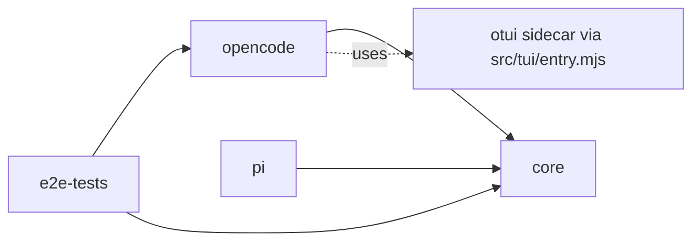
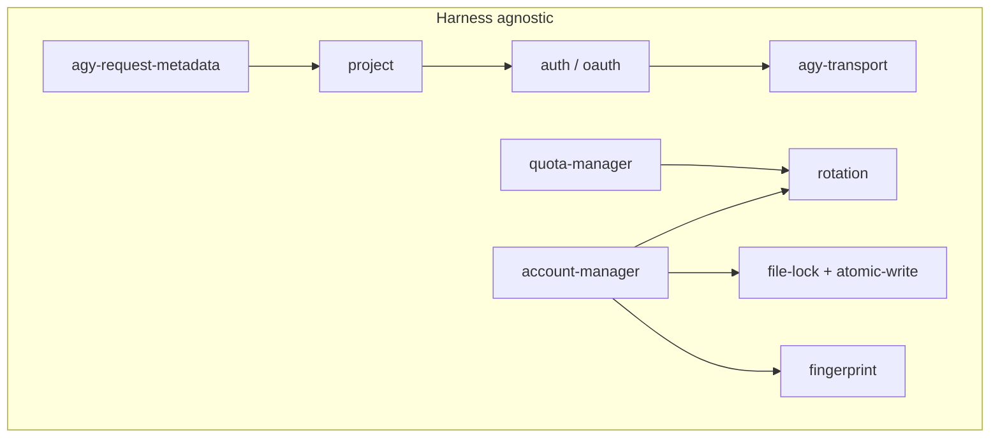
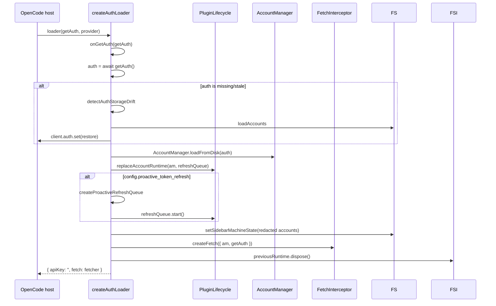
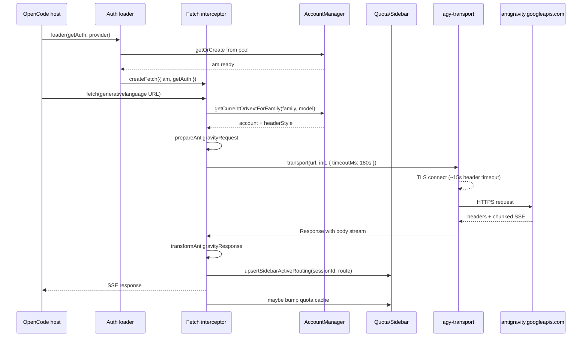
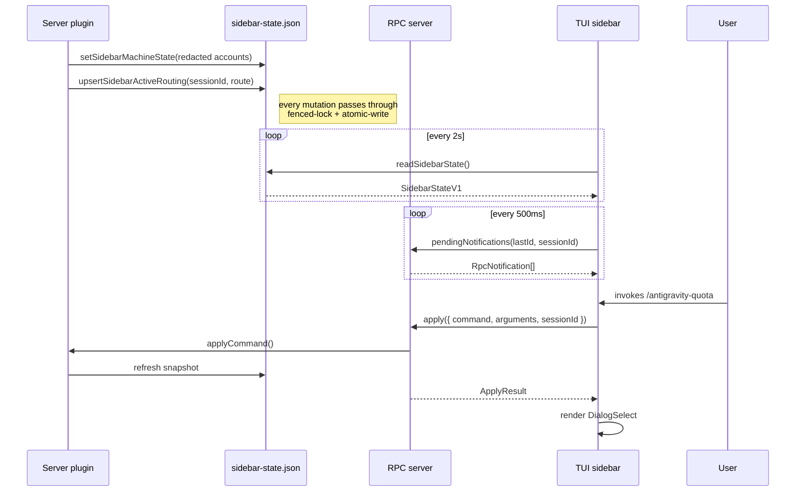
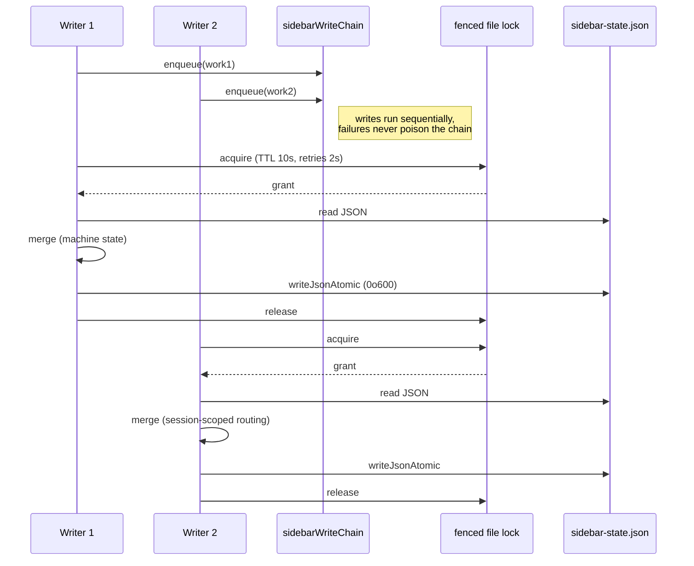
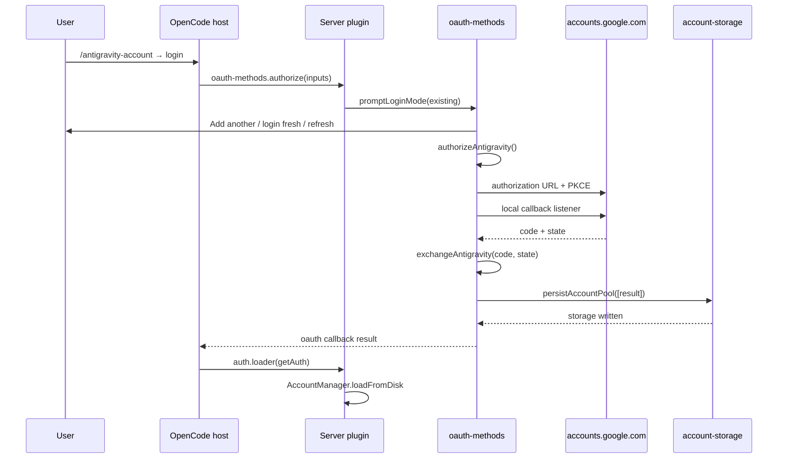
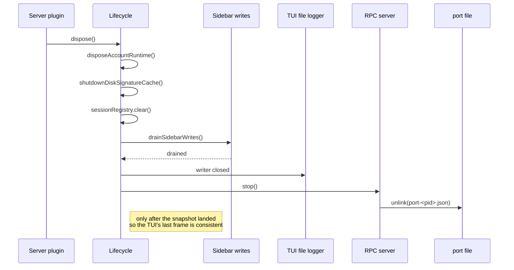

# Architecture

This document is the system-of-record for the `@cortexkit/antigravity-auth*` stack at the v2.0 parity refactor. It is written from the **final** source tree on the current `main` (`9a98a15`) — every cited symbol has a live line reference against the files that actually ship, not the prior single-file plugin that the refactor decomposed into `packages/opencode/src/plugin/index.ts` plus the slim `plugins/opencode/index.ts` barrel.

## System goals and boundaries

The stack solves three problems at the harness boundary:

1. **Let non-Google harnesses talk to Antigravity.** OpenCode and Pi both call `fetch()` against `generativelanguage.googleapis.com`; the Antigravity API only accepts requests shaped like the proprietary `agy` CLI. The plugin intercepts before the host's `fetch` and rebuilds the envelope (`User-Agent`, `Client-Metadata`, request body, SSE response) per credential.
2. **Manage a pool of Google OAuth accounts.** Each account has a refresh token, an Antigravity `projectId`, an optional `managedProjectId`, a per-account fingerprint, and a quota cache. The runtime rotates, cooldowns, refreshes, and persists them — the host never sees this layer.
3. **Render a live sidebar without writing to the host's terminal.** The OpenTUI tree is byte-perfect — any stray write corrupts the framebuffer. The plugin publishes a redacted snapshot to a file the TUI polls; slash commands flow over a loopback HTTP RPC with a bearer token the host's TUI process discovers through a port file.

Boundaries that the refactor enforces explicitly:

- **Core is harness-agnostic.** It only knows `fetch`, `node:fs`, `node:net`, and a `fetchAccountQuota` callback. It must not import `@opencode-ai/plugin` or `@earendil-works/pi-ai`. The corollary: every host runtime call is injected through `PluginDependencyOverrides` (`packages/opencode/src/plugin/dependencies.ts:1-204`).
- **The TUI is read-only.** `packages/opencode/src/tui.tsx:1-533` and the `tui-compiled/` twin only import from `sidebar-state.ts`, `rpc/rpc-client.ts`, `rpc/rpc-dir.ts`, and the local `tui/` folder. OAuth tokens, account storage, the fetch interceptor — none of those run inside the render path.
- **The plugin is one process, two render domains.** The server-side plugin (host-supplied `client`) and the OpenTUI sidebar live in separate process contexts. Communication is the loopback HTTP RPC plus the on-disk sidebar snapshot; the plugin never imports `@opentui/solid`.

## Package and process topology

Four published packages plus a private e2e workspace:

```
antigravity-auth/
├── packages/
│   ├── core/                 # @cortexkit/antigravity-auth-core — harness-agnostic
│   ├── opencode/             # @cortexkit/opencode-antigravity-auth — server + tui
│   ├── pi/                   # @cortexkit/pi-antigravity-auth — pi extension
│   └── e2e-tests/            # private: black-box flows against a mock loopback server
├── scripts/                  # build, dev, schema, smoke
└── package.json              # root monorepo script surface
```

The dependency direction is strictly one-way:



`packages/opencode/package.json:32-45` declares two `oc-plugin` entry points: `server` (the fetch interceptor / OAuth / quota controller) and `tui` (the OpenTUI sidebar) — the host loads them as separate plugin registrations. The Pi package's `pi.extensions` field (`packages/pi/package.json:34-38`) is the analogue. The core package has no peer dependencies on any host runtime; it only depends on Node built-ins and `@openauthjs/openauth`.

### Process topology at runtime

```mermaid
flowchart LR
  subgraph OCHost[OpenCode host process]
    direction TB
    ServerPlugin[server plugin<br/>createAntigravityPlugin]
    TuiPlugin[TUI plugin<br/>src/tui.tsx default export]
    ServerPlugin ~~~ TuiPlugin
  end
  subgraph Sidecar[Sidebar sidecar process]
    direction TB
    FileLogger[tui file logger]
  end
  subgraph Child[plugin runtime]
    direction LR
    Interceptor[createFetchInterceptor]
    QuotaMgr[createOpenCodeQuotaManager]
    AccMgr[AccountManager]
    RPC[RPC server]
  end
  ServerPlugin --> Interceptor
  ServerPlugin --> QuotaMgr
  ServerPlugin --> AccMgr
  ServerPlugin --> RPC
  TuiPlugin -. poll file .-> SidebarState[sidebar-state.json]
  SidebarState ~~~ RPC
  RPC -. 127.0.0.1:port + Bearer .-> TuiPlugin
  Interceptor --> AGY[Antigravity HTTPS]
  QuotaMgr --> AGY
  AccMgr --> Storage[(antigravity-accounts.json)]
  RPC --> Notif[notification queue]
```

The TUI loads the compiled bundle (`packages/opencode/src/tui/entry.mjs:30-38`) and discovers the live server through a per-pid port file (`packages/opencode/src/rpc/port-file.ts:27-52`). The inter-process boundary is the deliberate design choice — it lets the TUI be a `solid-js` renderer with zero credential exposure.

## Core library layers

`packages/core/src/index.ts:1-30` is the public surface. Each top-level export is a self-contained module groups by concern:

| Layer | Module | Lines | Responsibility |
| --- | --- | --- | --- |
| OAuth | `antigravity/oauth.ts` | core | `authorizeAntigravity`, `exchangeAntigravity`, PKCE pack/unpack |
| Token state | `auth.ts` | `packages/core/src/auth.ts:1-63` | `parseRefreshParts`, `formatRefreshParts`, expiry buffer |
| Transport | `agy-transport.ts` | `packages/core/src/agy-transport.ts:1-651` | TLS socket pool, chunked/gzip decode, header/idle timeouts |
| Active timeout | `fetch-timeout.ts` | `packages/core/src/fetch-timeout.ts:1-54` | 15s header-only abort for `globalThis.fetch` callers |
| Quota + planning | `quota-manager.ts` | `packages/core/src/quota-manager.ts:1-717` | Attributed fetch, exponential backoff, in-flight dedupe |
| Account pool | `account-manager.ts` | `packages/core/src/account-manager.ts:1-2083` | Selection, rate-limit state, fingerprint, soft-quota |
| Rotation | `rotation.ts` | `packages/core/src/rotation.ts:1-593` | Health score, token bucket, hybrid LRU classifier |
| Locking | `file-lock.ts` | `packages/core/src/file-lock.ts:1-390` | Renewable fenced file lock with eviction marker |
| Atomic file | `atomic-write.ts` | `packages/core/src/atomic-write.ts:1-52` | Temp + rename, 0o600, no copy fallback |
| Fingerprint | `fingerprint.ts` | core | Per-account device fingerprint + history |
| Project ctx | `project.ts` | core | `loadCodeAssist`, `ensureProjectContext` |
| Session metadata | `agy-request-metadata.ts` | `packages/core/src/agy-request-metadata.ts:1-259` | ConversationId, trajectoryId, payload ordering |
| Constants | `constants.ts` | `packages/core/src/constants.ts:1-269` | Endpoints, scopes, headers, sentinel values |
| Logger | `logger.ts` | core | `createLogger('module-name')` |

The account storage round-trip is owned by `packages/core/src/account-storage.ts`, which the opencode adapter wraps in `packages/opencode/src/plugin/storage.ts:1-410` (callers from the opencode side land there because the core exports a `store` interface that the host fills in).

### Layer dependency rules



The dependency graph is acyclic. No layer reaches into `account-manager` from `auth` — the auth module intentionally treats the refresh token as opaque so it can be reused by the Pi extension which has no concept of an account pool.

## OpenCode server plugin

### Composition root

`packages/opencode/src/plugin/index.ts:75-287` is the single factory `createAntigravityPlugin(providerId, options)`. It is the only host-facing surface; the package barrel at `packages/opencode/index.ts:1-4` re-exports the two stable aliases `{AntigravityCLIOAuthPlugin, GoogleOAuthPlugin}` produced by binding the factory to `ANTIGRAVITY_PROVIDER_ID = 'google'` (`packages/core/src/constants.ts:178`).

The factory wires one of every collaborator the host will ever need:

1. `resolvePluginDependencies(options.dependencies)` (line 78) — replaces the legacy shared mutable globals with a per-instance dependency bag covering `fetchImpl`, `agyTransport`, `filesystemRoots`, `oauth`, and `clock`.
2. `loadConfig(directory)` then `initRuntimeConfig(config)` (line 82-83) — the latter pushes the resolved config onto the `core` config singleton.
3. `initHealthTracker` / `initTokenTracker` / `initDiskSignatureCache` (lines 88-111) — populate the global rotation trackers with the user-configured weights.
4. `AgySessionRegistry` (line 113) — owns the per-workspace `AgyRequestSessionStore` from `packages/core/src/agy-request-metadata.ts:95-184`.
5. `createPluginLifecycle({...})` (line 115) — the disposal root.
6. `createOpenCodeQuotaManager` (line 126) — wraps the core `QuotaManager` with a `getAccountsForSidebar` closure so any quota refresh pushes the redacted sidebar snapshot.
7. `createOperatorSettingsController` (line 149) — backs the `/antigravity-*` slash commands. Config writes go through the fenced-lock writer so a crash mid-write cannot corrupt the file.
8. `createEventHandler`, `createSessionRecoveryHook`, `createAutoUpdateCheckerHook` (lines 161-174) — host lifecycle hooks.
9. `createFetchInterceptor` (line 217) — the per-instance interceptor built from `dependencies.agyTransport` and `dependencies.fetchImpl`. A fresh `authLoader` invocation rebuilds the interceptor with the new `AccountManager` (`packages/opencode/src/plugin/auth-loader.ts:154-156`).
10. `startRpcServer` (line 233) — the loopback HTTP server; the same factory call exposes `apply` (operator → plugin) and `drain` (plugin → TUI notifications) callbacks.

The factory returns a `PluginResult` with `dispose`, `config`, `command.execute.before`, `event`, `tool`, and `auth` hooks (`packages/opencode/src/plugin/index.ts:265-286`). The host's `auth.loader` is the one piece of business logic that runs every model call.

### Auth loader and the one active interceptor

`packages/opencode/src/plugin/auth-loader.ts:61-196` is the function the host invokes on every `auth` call. Its job is to materialize the `AccountManager` from the current session's auth + the on-disk pool, then hand the host a `fetch` closure bound to a fresh interceptor.



The redaction in `setSidebarMachineState` (`packages/opencode/src/plugin/auth-loader.ts:161-172`) uses `buildSidebarMachineStateFromAccounts` from `packages/opencode/src/sidebar-state.ts:484-500` so the TUI's snapshot is the only authoritative signal that the account pool exists.

### Fetch interceptor

`packages/opencode/src/plugin/fetch-interceptor.ts:1-2220` is the largest file in the tree. It owns the per-request retry/quota/routing pipeline. The outer loop at lines 518-... picks an account via `accountManager.getCurrentOrNextForFamily(...)` (line 603), then the inner loop at lines 1185-... walks the endpoint fallback list (`packages/core/src/constants.ts:46-49`) with per-endpoint capacity retry.

Key gates in the request lifecycle:

- `isGenerativeLanguageRequest(input)` (line 332) — any non-`generativelanguage.googleapis.com` URL passes through to the host fetch unchanged.
- `accessTokenExpired(authRecord)` (`packages/core/src/auth.ts:40-45`) — refresh via `refreshAccessToken` (line 803) before the request goes out; on `invalid_grant` the account is removed and the pool is rewritten.
- `ensureProjectContext(authRecord)` (line 925) — the most likely pre-flight failure; on rejection the account is cooled down via `markAccountCoolingDown` + `markRateLimited`.
- `prepareAntigravityRequest` (line 1210) — full sanitization pass: `sanitizeCrossModelPayload`, Claude thinking-block stripping, prefix-stabilized tool caching, fingerprint header injection, request-metadata labels.
- `transport(...)` (line 1011, 1059) — the only call site that uses the bounded `agyTransport` socket; non-Antigravity URL variants fall back to `upstreamFetch`.
- `transformAntigravityResponse` (line 1016) — runs the streaming reverse transform. The streaming transformer at `packages/opencode/src/plugin/core/streaming/transformer.ts` captures SSE tokens, caches thinking signatures, and emits `usageMetadata` to the caller.

The `RetryState` at `packages/opencode/src/plugin/fetch/retry-state.ts` and `WarmupState` at `packages/opencode/src/plugin/fetch/warmup.ts` are per-interceptor singletons; `createFetchInterceptor` constructs them at line 261-262 so disposing the plugin releases every counter.

### Dependency seam

`packages/opencode/src/plugin/dependencies.ts:1-204` defines the override surface. Production callers omit it; test/e2e callers pass `fetchImpl`, `agyTransport`, and `filesystemRoots` to redirect all outbound calls onto the mock server. The seam is the only reason the e2e workspace can run without touching the live Antigravity infrastructure (see **End-to-end data flows** below).

## OpenTUI process and trust boundary

### Two halves of the contract

The OpenTUI plugin is declared in `packages/opencode/package.json:32-45` as `"oc-plugin": ["server", "tui"]`. The host loads the TUI entry point separately; the entry dispatches to either the precompiled Solid bundle or the raw `tui.tsx` based on the host runtime module's availability (`packages/opencode/src/tui/entry.mjs:30-66`).

The two halves share a small amount of code through `packages/opencode/src/tui-compiled/` (the precompiled mirror) and the slim contract modules:

- `packages/opencode/src/sidebar-state.ts` — the read seam in the TUI's compiled tree, the read+write seam in the server plugin (lines 1-39 document the split).
- `packages/opencode/src/rpc/protocol.ts` — wire types (`CommandModalName`, `ApplyRequest`, `ApplyResult`, `RpcNotification`).
- `packages/opencode/src/rpc/rpc-client.ts` — the TUI's HTTP client.
- `packages/opencode/src/rpc/rpc-dir.ts` — resolves the per-project directory the port file lives in.

The TUI imports **none** of the OAuth, account, or fetch interceptor modules. The compiler would let it (TypeScript has no runtime privilege check), but the import graph review at `packages/opencode/src/tui.tsx:1-22` documents the rule.

### TUI render path

`packages/opencode/src/tui.tsx` is a `TuiPlugin` that registers a `slots.sidebar_content` slot. The slot renders a `SidebarPanel` Solid component that:

1. Polls `readSidebarState(props.stateFile)` every 2 seconds (`POLL_INTERVAL_MS = 2000`, line 50).
2. Polls the RPC server's `/rpc/pending-notifications` endpoint every 500ms for any new slash-command dialog (line 132).
3. Renders the per-account blocks: enabled badge, health bar, cooldown countdown, per-model quota bar (`<SidebarQuotaKey>` = `claude | gemini-pro | gemini-flash`, line 52).
4. Renders the active session route (line 254-275) — one entry per session that has issued a request through the fetch interceptor.
5. Surfaces a stale-routing indicator (`STALE_AFTER_MS = 15_000`, line 51) when the snapshot's `checkedAt` is older than the threshold or `routingAuthoritative` is false.

When a notification arrives, `openCommandDialogFromNotification` (line 495-531) rebuilds the dialog flow via `collectDialogFlow` and reuses the host's `DialogSelect` / `confirm` / `prompt` primitives from `tui/command-dialogs.tsx`. The result is a host-branded modal that the user can navigate with the keyboard.

### File logger

`packages/opencode/src/tui/file-logger.ts:1-138` writes logs to `<xdg-state>/cortexkit/antigravity-auth/tui.log` (mode 0o600, 1 MB tail-truncated). The file logger is the only place the TUI emits diagnostics; it never writes to stdout/stderr because the host owns the framebuffer.

### RPC protocol

`packages/opencode/src/rpc/protocol.ts:1-29` defines the wire shape:

- `OpenDialogPayload` — `{ command, text, knobs }` — the message from plugin to TUI.
- `RpcNotification` — `OpenDialogPayload & { id, sessionId? }` — the queued push.
- `ApplyRequest` / `ApplyResult` — `{ command, arguments, sessionId? }` / `{ text, knobs }`.

The server side is `packages/opencode/src/rpc/rpc-server.ts:1-300`:

- `startRpcServer({ dir, apply, drain })` binds to `127.0.0.1:0` (line 87) so the OS picks a free port, generates a 32-byte hex bearer token (line 62), writes the port file via `writePortFile` (line 97), and returns `{ port, token, stop }`.
- `handleRequest` (line 127-166) accepts `POST /rpc/apply` (server timeout 120s, `APPLY_TIMEOUT_MS`) and `POST /rpc/pending-notifications` (request timeout 2s, `REQUEST_TIMEOUT_MS`).
- `isAuthorized` (line 168-177) uses `timingSafeEqual` after padding to a fixed length so callers with the wrong-length token cannot observe a timing side-channel.
- `closeServer` resolves the in-flight keep-alive sockets via `closeAllConnections`.

The client side is `packages/opencode/src/rpc/rpc-client.ts:1-76`. `createRpcClient(dir, expectedPid)` reads the port file via `discoverPortFile` (which skips dead pids) and posts JSON with `Authorization: Bearer <token>`. The default 2s timeout is enforced via `fetchWithActiveTimeout` from `packages/core/src/fetch-timeout.ts:28-54`.

The notification queue is `packages/opencode/src/rpc/notifications.ts:1-62`. `pushNotification` enqueues with a monotonic id; `drainNotifications` returns anything newer than the caller's `lastReceivedId` for the requested session. `isTuiConnected` reflects whether the TUI polled within the last 5 seconds (`CONNECTION_TTL_MS`, line 4).

### Port file discovery

`packages/opencode/src/rpc/port-file.ts:27-127` writes `<dir>/port-<pid>.json` with `{ pid, port, token }` (mode 0o600, atomically via `renameSync` from a `.tmp` sibling). `discoverPortFile` walks every `port-*.json` in the directory, validates the JSON, deletes dead-pid entries, and returns the most recent live entry. The pid-scoped naming means a crashed OpenCode process never blocks a new one from binding.

`packages/opencode/src/rpc/rpc-dir.ts:1-27` resolves the directory: `ANTIGRAVITY_AUTH_RPC_DIR` env var wins, otherwise `<XDG_STATE_HOME>/cortexkit/antigravity-auth/rpc/<sha256(directory)[:16]>` so multiple workspaces can coexist.

## Pi extension

`packages/pi/src/index.ts:1-111` is the package's only entry. Pi's contract is `function (pi: ExtensionAPI): void` — the extension exports a default function that registers a custom OAuth provider:

- `providerId = 'google-antigravity'` (line 16).
- `pi.registerProvider(ANTIGRAVITY_PROVIDER_ID, { name, baseUrl, api, models, oauth, streamSimple })` (line 93-110).
- `models` is `getPublicModelDefinitions()` filtered to drop image-output (Pi's `AssistantMessage` protocol has no image output type) and re-mapped onto Pi's `Model` shape (`packages/pi/src/index.ts:78-91`).
- `oauth.login` invokes `authorizeAntigravity` from core, asks the host for the callback URL/code via `callbacks.onPrompt`, and calls `exchangeAntigravity` (line 22-58).
- `oauth.refreshToken` reads the packed `refreshToken|projectId|managedProjectId` triple, calls `refreshAntigravityToken` for the bare refresh, and re-packs the project segments (line 60-75).
- `oauth.getApiKey` bridges the packed refresh into the stream by stashing it in `credential-cache.ts` so the stream can rejoin project context after the access token is stripped (line 102-107).
- `streamSimple` is `streamCortexKitAntigravity` from `packages/pi/src/stream.ts:1-...`.

The package's `package.json` (`packages/pi/package.json:34-58`) declares `pi.extensions: ['./dist/index.js']` and pulls Pi's three peer dependencies from `@earendil-works/`.

### Pi's package-name dependency on the host

The Pi extension depends on the Pi runtime through `peerDependencies` (`packages/pi/package.json:48-52`) — `@earendil-works/pi-ai`, `@earendil-works/pi-coding-agent`, `@earendil-works/pi-tui` — and the package's `keywords` field includes `pi-package` (line 27) so the Pi package manager discovers it. The extension is resolved by name in the user's Pi config:

```jsonc
{
  "extensions": ["@cortexkit/pi-antigravity-auth"]
}
```

There is **no direct dependency on any specific version** — Pi handles the extension loading and the peer-dependency resolution at runtime. This keeps the extension portable across Pi versions.

## End-to-end data flows

### 1. OpenCode request / response



The header timeout is **15s** via `fetchWithActiveTimeout` (`packages/core/src/fetch-timeout.ts:13-54`) for any fetch through the standard primitive — but the Antigravity path uses the raw socket transport which has its own timeouts (see **Timeouts** below).

### 2. OpenTUI sidebar render path



### 3. Account lock-held read-modify-write

The `setSidebarMachineState` writer is the canonical plate-spinner. Two writers racing (e.g. a quota refresh and a routing upsert) must not interleave merges against the same file.



The lock is `acquireFencedFileLock` from `packages/core/src/file-lock.ts:143-273` — see **Account persistence and concurrency** for the eviction marker protocol.

### 4. OAuth login



The local callback listener is `packages/opencode/src/plugin/server.ts:startOAuthListener`, which times out and falls back to manual paste for headless / WSL2 environments. The listener's port is `http://localhost:51121/oauth-callback` (`packages/core/src/constants.ts:29`).

### 5. TUI dispose / route migration



The order is enforced by `createPluginLifecycle` — `drainSidebarWrites` runs before any registered disposable (`packages/opencode/src/plugin/lifecycle.ts:72-91`). The plugin's `dispose` therefore guarantees that the last sidebar write from `upsertSidebarActiveRouting` has hit disk before the host moves on.

## Account persistence and concurrency

### Storage shape

`packages/core/src/account-storage.ts` defines the on-disk shape: `AccountStorageV4` with a `version: 4`, `accounts[]`, `activeIndex`, `activeIndexByFamily: { claude, gemini }`. Each account carries `refreshToken`, `email`, `projectId`, `managedProjectId`, `addedAt`, `lastUsed`, `enabled`, `rateLimitResetTimes`, `coolingDownUntil`, `cooldownReason`, `fingerprint`, `fingerprintHistory`, `verificationRequired`, `accountIneligible`, `cachedQuota`, `cachedQuotaUpdatedAt`, `dailyRequestCounts`. The OpenCode adapter wraps this in `packages/opencode/src/plugin/storage.ts:1-410` which adds the on-disk path resolver and the `mutateAccountStorage` helper.

### Why a custom lock instead of a third-party dependency

The original lock implementation pulled in a third-party `flock`-style cross-process mutex. The refactor replaced it with a **`renovating fenced file lock`** (`packages/core/src/file-lock.ts:1-390`) because:

1. **No external dependency.** `node:fs/promises` is enough; the entire mechanism is a `wx`-exclusive placement of a JSON blob and a `mkdir`+`writeFile` for the eviction marker.
2. **Renewable.** The lock file at `${path}.${name}.lock` carries `{ ownerId, expiresAt }`. A `setInterval` (unref-ed) rewrites the expiration every `max(1000, floor(ttlMs / 3))` ms (line 286-333). A contender that loses its renewal just lets the lock expire.
3. **Eviction marker prevents revive races.** A stale lock is only claimable if the contender first stamps `${lockPath}.evicting/owner.json` with its own `ownerId` (line 200-225). The contender re-verifies the marker owner at every destructive seam (unlink, re-acquire) — a contender whose marker was hijacked between the claim and the unlink backs off without touching the winner's lock file.
4. **`assertOwned()` detects footguns.** The lock interceptor calls `assertOwned()` after acquisition and before the merge; if the lockfile was reclaimed by another writer, the merged write is rejected with `FileLockOwnershipError` (`packages/core/src/file-lock.ts:73-87`) instead of corrupting state.

### Atomic write

`packages/core/src/atomic-write.ts:1-52` does the rename-on-POSIX dance: stage `${path}.${randomUUID()}.tmp` at mode 0o600, rename onto the target, clean up on failure. There is **no copy fallback** — a copy-then-unlink after a failed rename can mask partial writes and is explicitly forbidden in the header comment. Callers decide whether to retry, surface, or back off.

### Sidebar state merge

`packages/opencode/src/sidebar-state.ts` is the most stateful writer. The merge seam (`mergeMachineState`, line 600-625) is deterministic:

- **Stale writes are dropped.** If `next.checkedAt < existing.checkedAt`, the existing state is returned untouched (only `activeRouting` is pruned to evict expired entries).
- **`routingAuthoritative` is sticky-true.** Once true, any later non-authoritative write preserves the `true` flag.
- **`activeRouting` is merged independently and pruned** to the freshest 100 entries within 24h (`ACTIVE_ROUTING_MAX_AGE_MS`, `ACTIVE_ROUTING_MAX_ENTRIES`, line 118-120).

The `sidebarWriteChain` (line 506-517) is the in-process serialization: every writer appends to a single Promise chain so two concurrent `setSidebarMachineState` calls do not race through the lock acquisition. Failures never poison the chain (line 511-516).

### `drainSidebarWrites` semantics

`packages/opencode/src/sidebar-state.ts:524-526` returns the chain's tail. The plugin lifecycle (`packages/opencode/src/plugin/lifecycle.ts:79-83`) awaits it before tearing down the RPC server and the file logger, so a fetch-interceptor routing upsert that resolves during shutdown lands before the host closes the terminal framebuffer.

## Quota, routing, and killswitch semantics

### Quota manager

`packages/core/src/quota-manager.ts:1-717` is the harness-agnostic core. It exposes a `fetchAccountQuota` callback the host plugs in; the manager tracks per-account state (consecutive failures, backoffUntil, inflight promise, cached result) keyed by stable identity (`keyOf`, line 111-115) — email preferred, hash of refresh token as fallback.

| Behavior | Where |
| --- | --- |
| Exponential backoff | `recordFailure` (line 138-155) — `max(10min, base * 2^fails)` |
| In-flight dedupe | `refreshAccount` (line 224-230) — second caller awaits the first one's promise |
| Manual bypass | `RefreshAccountOptions.force` (line 65-71) — manual quota dialog always uses `force: true` |
| Disposed mid-fetch | `controller.signal.aborted` (line 248-250) — `dispose()` cancels all controllers |
| Concurrency cap | Per-key, not pool-wide — backoff ends the storm |

The aggregated result is split into `quota` (Antigravity-headers) and `geminiCliQuota` (Gemini CLI headers) — they share the same account object but the UI exposes both because the user can pick header style.

### Selection algorithm

`packages/core/src/account-manager.ts:getCurrentOrNextForFamily` (line 685-868) is the central dispatcher. Strategies:

- **`sticky`** (default) — keep the current account until it goes unavailable; on unavailability, advance the cursor to the next account that is enabled, not rate-limited, not over the soft-quota threshold, and not cooling down.
- **`round-robin`** — same as sticky but advances the cursor on every selection so a session rotates across accounts.
- **`hybrid`** — uses `selectHybridAccount` from `packages/core/src/rotation.ts:376-433`, which scores each candidate on `2*health + 5*tokenFraction + 0.1*freshness`, applies a stickiness bonus to the current account, and only switches when the new account beats the current by `SWITCH_THRESHOLD = 100` (line 361).

The `pidOffsetEnabled` flag (line 805-825) lets multi-session hosts distribute load: each session's pid hashes to a starting offset so two simultaneous sessions do not pick the same account.

### Soft-quota protection

`packages/core/src/account-manager.ts:isOverSoftQuotaThreshold` (line 230-258) reads the cached quota remaining-fraction. If the account's cached quota is older than `softQuotaCacheTtlMs` (computed via `computeSoftQuotaCacheTtlMs`, `packages/core/src/rotation.ts:90-101`), the soft-quota check is **skipped** — fresh quota data is a precondition.

The protection is wedged to the single-account case: `getEffectiveSoftQuotaThreshold` (line 494-498) forces the threshold to 100 if there is only one enabled account. A user with no alternative rotation partner must not be blocked.

### Routing

Two header styles: `antigravity` (Electron-style UA + `X-Goog-Api-Client` + `Client-Metadata`) and `gemini-cli` (`GeminiCLI/{}/{}/({}; {})` UA). Claude has only `antigravity`; Gemini has both. The resolver is `resolveHeaderRoutingDecision` (`packages/opencode/src/plugin/fetch-routing.ts`) and the fallback is `resolveQuotaFallbackHeaderStyle`. When the preferred style is rate-limited for the chosen account, the interceptor either switches account (if another account has the preferred style available) or flips to the alternate style.

The per-call routing decision is read live from `operatorSettings.get().routing` (`packages/opencode/src/plugin/fetch-interceptor.ts:460-466`) so a `/antigravity-routing` slash command takes effect on the next dispatched call without a plugin restart.

### Killswitch

`packages/opencode/src/plugin/killswitch.ts:1-224` exposes `evaluateKillswitchForAccount` and `throwIfAllKilled`. The operator sets a `minimum_remaining_percent` per family/model; any account whose freshest quota falls below the threshold is excluded from selection. The killswitch **fails open on missing/stale quota** (line 547 of `fetch-interceptor.ts`) so a cold start cannot deadlock the pipeline.

## OAuth and token lifecycle

### Login

1. `oauth-methods.authorize(inputs)` (`packages/opencode/src/plugin/oauth-methods.ts:382-...`) — handles the CLI menu (`Add another`, `Refresh`, `Check quotas`, `Verify accounts`, `Doctor`, `Manage`, `Cancel`).
2. `authorizeAntigravity` from core — generates a PKCE verifier, calls the authorize endpoint, returns the URL.
3. `startOAuthListener` from `packages/opencode/src/plugin/server.ts` — opens a localhost listener on `51121`; the redirect URL is `http://localhost:51121/oauth-callback`. For WSL2 / headless / no-X environments the plugin skips the listener and prompts the user to paste the redirect URL.
4. `exchangeAntigravity(code, state)` — verifies the state, exchanges the code, returns `{ refresh, access, expires, email, projectId }`.
5. `persistAccountPool([result], startFresh)` — re-reads the locked storage, appends the new account, writes atomically.

### Refresh

`packages/opencode/src/plugin/token.ts:refreshAccessToken` is the in-flight refresh path. The interceptor calls it when `accessTokenExpired(authRecord)` (a 60s buffer before `expires`). On `invalid_grant` the account is removed and the pool is rewritten; on transient failures the account is cooled down via `markAccountCoolingDown` + `markRateLimited`.

`packages/opencode/src/plugin/refresh-queue.ts:1-349` adds the proactive refresh: `createProactiveRefreshQueue` runs every `proactive_refresh_check_interval_seconds` (default 5min) and refreshes any account whose access token expires within `proactive_refresh_buffer_seconds` (default 10min). The queue re-uses the global `fetcher` and pushes the refreshed quotas into the sidebar.

### Disposal

`shutdownDiskSignatureCache` (`packages/opencode/src/plugin/cache.ts`) flushes the in-memory signature cache to disk before the plugin tears down so the next session can resume without re-priming the cache.

### Sentinel values

`SKIP_THOUGHT_SIGNATURE = 'skip_thought_signature_validator'` (`packages/core/src/constants.ts:227`) is the sentinel for thinking-block signature bypass. The plugin injects it whenever a cache-miss or session-mismatch would otherwise cause a server-side validation failure. It is an officially supported Google API feature used by `gemini-cli` and the Google .NET SDK.

## Request transformation and streaming response flow

### Outbound transform

`packages/opencode/src/plugin/request.ts:1-2854` is the upstream of `prepareAntigravityRequest`. The pipeline:

1. **Sanitize** — strip Claude thinking blocks (`packages/core/src/transform/claude.ts`), normalize cross-model payloads (`packages/core/src/transform/cross-model-sanitizer.ts`), apply `applyGeminiTransforms` / `applyClaudeTransforms` (`packages/core/src/transform/`) depending on the resolved model family.
2. **Resolve** — `resolveModelWithTier` from `packages/core/src/transform/model-resolver.ts` maps the user-facing tag (`claude-sonnet-4-6`) to the Antigravity wire model and the header style.
3. **Inject** — `buildAgyRequestMetadata` from `packages/core/src/agy-request-metadata.ts:231-259` produces the `labels` block (`last_step_index`, `model_enum`, `trajectory_id`, `used_claude`, `used_claude_conservative`, `used_non_gemini_model`) and the `requestId` (`agent/<conversationId>/<timestamp>/<trajectoryId>/<step>`).
4. **Stabilize prefix** — `orderAgyRequestPayloadInPlace` (line 190-210) reorders the payload so the field order is `contents → systemInstruction → tools → toolConfig → labels → generationConfig → sessionId`. This is the prefix the prompt cache keys on; a stable prefix is what gives Antigravity its cache hit rate.
5. **Harden** — `CLAUDE_TOOL_SYSTEM_INSTRUCTION` (`packages/core/src/constants.ts:191-203`) is injected when tools are present to reduce hallucinated parameter names.

### Inbound transform

`packages/opencode/src/plugin/core/streaming/transformer.ts` is the streaming reverse transform. It:

- Strips Antigravity's `response.envelope` metadata before the caller sees the body.
- Splices `thoughtSignature` values back into thinking blocks so the caller can carry them on the next request.
- Aggregates `usageMetadata` events into a single final emission.
- Caches signatures to the disk-backed signature store (`packages/opencode/src/plugin/cache/signature-cache.ts`) keyed by `(model, sessionId, lastStepIndex)`.

The transformer produces a `ReadableStream<Uint8Array>` so the host's `await response.text()` works without buffering.

### Timeouts

The stack has three distinct timeout systems, **deliberately separated**:

| Timeout | Default | Scope | Where |
| --- | --- | --- | --- |
| Response header timeout | **15s** | `fetchWithActiveTimeout` for any caller using `globalThis.fetch` | `packages/core/src/fetch-timeout.ts:13-54` |
| AGY response header timeout | **180s** | TLS connect + response headers via raw socket | `packages/core/src/agy-transport.ts:12` |
| AGY idle timeout | **180s** | Stalled response body — kills the socket if no bytes for 180s | `packages/core/src/agy-transport.ts:16` |

The 15s `ACTIVE_FETCH_TIMEOUT_MS` is stream-safe: it only aborts the request signal until the underlying `fetchImpl` resolves, then removes the timeout listener so the returned body can be streamed past the deadline (`packages/core/src/fetch-timeout.ts:28-54`). The 180s `DEFAULT_AGY_RESPONSE_HEADER_TIMEOUT_MS` covers the Antigravity `agy` CLI's own connect behavior, and the 180s `DEFAULT_AGY_IDLE_TIMEOUT_MS` is a watchdog against a hung body — it resets on every received chunk (line 505-525 in `agy-transport.ts`). The two are independent: a slow but streaming response triggers neither.

```mermaid
gantt
    title Active timeout vs streaming idle timeout
    dateFormat X
    axisFormat %s
    section 15s active-fetch
    Abort if headers not received by 15s :crit, 0, 15s
    section 180s agy header
    Abort if no headers after 180s :crit, 0, 180s
    section 180s agy idle
    Reset on every body byte :active, 0, 180s
    Silent between chunks : 0, 180s
```



### Endpoint fallback

`ANTIGRAVITY_ENDPOINT_FALLBACKS = [DAILY, PROD]` (`packages/core/src/constants.ts:46-49`). The interceptor walks them in order under the `MAX_TOTAL_CAPACITY_RETRIES` cap (`packages/opencode/src/plugin/fetch-routing.ts`); for `gemini-cli` header style only `PROD` is used (line 1199-1207 of `fetch-interceptor.ts`).

### Retry-after and rate-limit bookkeeping

`retryAfterMsFromResponse` (`packages/opencode/src/plugin/fetch-interceptor.ts:117-138`) reads `retry-after-ms` first, then `retry-after` (seconds), then a 60s default. The result feeds `markRateLimitedWithReason` which combines the header with `calculateBackoffMs` from `packages/core/src/rotation.ts:59-88`:

- `QUOTA_EXHAUSTED` — 1m → 5m → 30m → 2h scale-up.
- `RATE_LIMIT_EXCEEDED` — 30s.
- `MODEL_CAPACITY_EXHAUSTED` — 45s ± 15s jitter.
- `SERVER_ERROR` — 20s.
- `UNKNOWN` — 60s.

The failure tally is per-account and resets after a 1h TTL (`markRateLimitedWithReason`, `packages/core/src/account-manager.ts:1058-1091`).

## Sidebar snapshot and RPC protocols

### Snapshot file

`packages/opencode/src/sidebar-state.ts` documents the contract in its module header (line 1-38). The on-disk shape is `SidebarStateV1`:

```ts
{
  version: 1,
  checkedAt: number,
  accounts: SidebarAccountState[],   // redacted — no tokens, no project IDs
  activeRouting: Record<sessionId, SidebarRoutingEntry>,
  routingAuthoritative: boolean,
  quotaBackoffUntil?: number,
  lastError?: string
}
```

The path is `getSidebarStateFile()` (line 193-198): `ANTIGRAVITY_AUTH_SIDEBAR_STATE_FILE` wins, otherwise `<xdg-state>/cortexkit/antigravity-auth/sidebar-state.json`. The file is mode 0o600 with a 0o700 parent dir.

### RPC bearer/discovery

`packages/opencode/src/rpc/rpc-server.ts:62, 87` generates a 32-byte hex token and binds to `127.0.0.1:0`. The (pid, port, token) tuple is written to `<rpc-dir>/port-<pid>.json` via `packages/opencode/src/rpc/port-file.ts:27-52`. The TUI discovers the server with `discoverPortFile(dir, process.pid)` — file paths are pid-scoped so a crashed OpenCode cannot block a new one. The token is regenerated every plugin boot; the host process owns the only handle.

### Notification queue

`packages/opencode/src/rpc/notifications.ts:1-62` is a bounded queue (max 100 entries). The host-side push is `pushNotification(payload, sessionId?)` and the TUI-side drain is `drainNotifications(lastReceivedId, sessionId?)`. The 5-second `CONNECTION_TTL_MS` is the signal `isTuiConnected(sessionId?)` uses to suppress commands when the TUI is not running.

The host's `apply` callback (line 233-260 of `plugin/index.ts`) calls `applyCommand(request, { sessionID, settings, onApplied: createSidebarRefresher(...) })` so every `/antigravity-*` mutation bumps the sidebar's `checkedAt` for the next TUI poll.

## Lifecycle and disposal

`createPluginLifecycle` (`packages/opencode/src/plugin/lifecycle.ts:1-93`) is the disposal root. The order is significant and the code documents it:

1. `disposeAccountRuntime()` — tear down the refresh queue, then the account manager.
2. `shutdownDiskSignatureCache()` — flush the in-memory signature cache to disk.
3. `sessionRegistry.clear()` — drop the per-session `AgyRequestSessionStore`.
4. `clearFetchState()` — null the cached `getAuth` binding so a late-arriving `loader` call sees a clean slate.
5. `drainSidebarWrites()` — wait for every queued sidebar write to land.
6. Dispose every registered disposable in registration order (RPC server, file logger, auto-update checker, etc.).

The default registration order is established by `packages/opencode/src/plugin/index.ts:80-263`; each registered disposable is free to register its own in `dispose()`.

The server emits a stop on the RPC server that closes `closeAllConnections()` (`packages/opencode/src/rpc/rpc-server.ts:281-292`) and unlinks the port file (line 116-119). The TUI detects the server has gone away when `discoverPortFile` returns `null` and surfaces the "Awaiting Antigravity state" empty state.

`createAntigravityPlugin` returns the `dispose` of the lifecycle as the plugin's `dispose` so the host's plugin teardown drives ours.

## Error handling and recovery strategy

The plugin follows the **fail-open / heal-loud** doctrine. Errors are always converted to one of:

- A toast on the host TUI (with debouncing via `RetryState.shouldShowRateLimitToast`).
- A cooldown on the offending account (so the next request rotates).
- A redacted `lastError` field in the sidebar snapshot.

Specific recovery paths:

- **Storage corruption** — `loadConfigFile` in `packages/opencode/src/plugin/config/loader.ts:64-95` swallows a bad JSON or schema mismatch and falls back to the default config. The plugin never crashes on a malformed user config.
- **Auth drift** — `detectAuthStorageDrift` (`packages/opencode/src/plugin/auth-drift.ts`) compares the host's auth against the stored account pool and offers a `restorable` path that re-issues the host's auth from the stored account.
- **Refresh token revoked** — `AntigravityTokenRefreshError` with `code: 'invalid_grant'` removes the account from the pool and persists the removal with `saveToDiskReplace` (`packages/opencode/src/plugin/fetch-interceptor.ts:847-859`).
- **Project context failure** — `ensureProjectContext` failures mark the account as cooling down with reason `project-error` (line 932-948).
- **Capacity exhaustion (529/503)** — the inner-account retry loop probes the next endpoint in the fallback list, capped at `MAX_TOTAL_CAPACITY_RETRIES`. Beyond the cap, the request rotates to the next account.
- **All accounts over soft-quota** — `getMinWaitTimeForSoftQuota` returns the soonest reset; if the wait exceeds `max_rate_limit_wait_seconds` (default 300s) the interceptor returns a synthetic 200 envelope describing the wait instead of blocking the host.
- **All accounts rate-limited, no quota fallback** — synthetic 200 with the same pattern as the soft-quota case.
- **Killswitch trips** — `throwIfAllKilled` raises `AntigravityKillswitchError` (`packages/opencode/src/plugin/errors.ts`), intercepted at `packages/opencode/src/plugin/fetch-interceptor.ts:587-600` and returned as a synthetic error response.
- **Cross-process lock contention** — `SidebarStateLockContentionError` after 2s of retries (`packages/opencode/src/sidebar-state.ts:122-126, 549-555`); the writer swallows it and the next attempt re-tries the merge.
- **Process cancellation** — every long-running call honors `AbortSignal`; `connectTlsWithAbort` (`packages/core/src/agy-transport.ts:626-651`) races the TLS connect against the abort.

The fundamental rule: **the user never sees a silent failure**. Either they see a toast, a synthetic error response, or the next account's attempt. The host's error reporting layer is never directly exposed to auth/quota failures.

## Security model

### Trust boundaries

1. **Host → plugin.** The host passes an opaque auth record (`getAuth: () => Promise<AuthDetails | undefined>`). The plugin never sees the host's API key store, only the refresh token it has itself persisted.
2. **Plugin → Antigravity.** Every request carries `Authorization: Bearer <accessToken>` and the per-account fingerprint `User-Agent`. The token is short-lived; refresh is the proactive queue's job.
3. **Plugin → TUI.** The TUI receives a **redacted snapshot**. `redactAccountForSidebar` (`packages/opencode/src/sidebar-state.ts:432-477`) zeroes the refresh token, access token, project ID, fingerprint, and every other credential-shaped field. The TUI only sees `id`, `label`, `enabled`, `health`, `current`, `cooldownUntil`, and the redacted `quota` block.
4. **TUI → RPC server.** The TUI talks to the server over `127.0.0.1` only (the server refuses to bind elsewhere per `LOOPBACK_HOST = '127.0.0.1'`, `packages/opencode/src/rpc/rpc-server.ts:19`). The bearer token is a 32-byte hex (`randomBytes(32)` line 62) and is regenerated every plugin boot. Discoverability is through a per-pid port file rather than a fixed port, so a wild guess on the port side is needed as well.
5. **Plugin → file system.** Sensitive files (account storage, signature cache, sidebar state, port file, TUI log) are written mode 0o600 with the parent directory at 0o700. POSIX rename replaces the inode so the new file inherits the staged mode bits. Windows is best-effort — the policy is enforced at the application layer because Windows does not honor POSIX mode bits.

### Redaction rules

The snapshot is the only place the TUI meets the live pool. The redaction is a structural contract, not an afterthought:

- `SidebarQuotaKey` is a fixed 3-tuple (`claude | gemini-pro | gemini-flash`); any other key on the input is dropped.
- `SidebarRoutingEntry` carries `accountId`, `modelFamily`, `headerStyle`, `updatedAt` — no token, no project ID, no fingerprint.
- `normalizeAccount` rejects any account missing `id` or `label` (line 281-282) so a malformed disk snapshot cannot surface an empty box in the UI.
- The TUI's compiled tree imports only `sidebar-state.ts`, the `rpc/` slim client, and the local `tui/` helpers. The TypeScript compiler would let it import the entire opencode package; the module-graph review is the only enforcement.

### Token timing

`accessTokenExpired` carries a 60s buffer (`ACCESS_TOKEN_EXPIRY_BUFFER_MS`, `packages/core/src/auth.ts:3`). The proactive refresh queue refreshes inside `proactive_refresh_buffer_seconds` (default 10min) so the user request never carries an expired token.

## Cross-cutting concerns

### Logging

`createLogger('module-name')` (`packages/core/src/logger.ts`) produces a structured logger that maps to the OpenCode TUI's `app.log` channel or a file sink. Every module consumes it (`createLogger('plugin')`, `createLogger('auth-loader')`, …). The TUI's `tui/file-logger.ts` is the analogue for the sidecar — it writes to a rotating file (1 MB, 200 lines tail) and never touches stdout/stderr.

### Caching

| Cache | Location | Eviction |
| --- | --- | --- |
| Quota cache | `account.cachedQuota` (in-memory) + `account-storage.ts` (disk) | Per-account TTL via `softQuotaCacheTtlMs` |
| Signature cache | `packages/opencode/src/plugin/cache/signature-cache.ts` (disk) + `initDiskSignatureCache` (memory) | TTL keyed by `(model, sessionId, lastStepIndex)` |
| AgyRequestSessionStore | `packages/core/src/agy-request-metadata.ts:95-184` | 24h TTL or 256 entries, whichever lands first |
| Sidebar routing map | `packages/opencode/src/sidebar-state.ts:118-120` | 24h max age, max 100 entries |
| Account manager session state | `packages/core/src/account-manager.ts:535-561` | 24h TTL or 256 entries |

### Randomness

The two delays that carry jitter (`addJitter`, `randomDelay`) are at `packages/core/src/rotation.ts:290-313`. The interval retry backoff in `acquireFencedFileLock` (line 217-220) and the `firstRetryDelayMs` in the fetch interceptor (`packages/opencode/src/plugin/fetch-interceptor.ts:78`) are also jittered to break predictable patterns.

### Configuration knobs

`packages/opencode/src/plugin/config/schema.ts` (Zod 4 schema) defines every user-configurable knob. The plugin reads `config.health_score`, `config.token_bucket`, `config.signature_cache`, `config.proactive_token_refresh`, `config.account_selection_strategy`, `config.max_account_switches`, `config.quota_refresh_interval_minutes`, `config.soft_quota_threshold_percent`, `config.auto_update`, `config.quiet_mode`, `config.toast_scope`, `config.pid_offset_enabled`, `config.cli_first`, `config.quota_style_fallback`, `config.cache_warmup_on_switch`, `config.thinking_warmup`, `config.request_jitter_max_ms`, `config.verify_signature_cache`, `config.max_rate_limit_wait_seconds`, `config.session_recovery`, `config.keep_thinking`, `config.proactive_refresh_*`, `config.switch_on_first_rate_limit`, `config.switch_account_delay_ms`, `config.proactive_rotation_threshold_percent`, `config.claude_tool_hardening`, `config.claude_prompt_auto_caching`, and `config.killswitch_*`. The operator settings controller layers runtime overrides on top of the file config so `/antigravity-*` slash commands mutate the live values without rebooting the plugin.

### OpenCode auto-update

`packages/opencode/src/hooks/auto-update-checker/index.ts:1-196` lights up on the host's `session.created` event (skipped for child sessions — `props.info.parentID` check). It uses the XDG cache to memoize the resolved version; on a sessionless first run it does a network probe against the package's npm registry. In local dev mode it surfaces the local version as a toast and skips the network probe.

### Diagnostics

`packages/opencode/src/plugin/debug.ts` provides `startAntigravityDebugRequest`, `logAntigravityDebugResponse`, `logRateLimitEvent`, `logRateLimitSnapshot`, `logResponseBody`, `logAccountContext`. The OpenCode adapter wires them into the fetch interceptor so a debug-enabled user can trace every request, every retry, every quota update.

## Testing and release gates

### Unit tests

`bun test` runs the colocated `*.test.ts` files. The plugin and core packages have `bun test --isolate ./src` (the `--isolate` flag prevents Bun's test runner from sharing module state across files). The tests cover:

- `core/`: `account-manager.test.ts`, `agy-transport.test.ts`, `agy-request-metadata.test.ts`, `atomic-write.test.ts`, `file-lock.test.ts`, `fetch-timeout.test.ts`, `fingerprint.test.ts`, `model-registry.test.ts`, `project.test.ts`, `quota-manager.test.ts`, `rotation.test.ts`, `account-storage.test.ts`, `transform/cross-model-integration.test.ts`, `transform/claude.test.ts`, `transform/cross-model-sanitizer.test.ts`, `transform/gemini.test.ts`, `transform/model-resolver.test.ts`, `antigravity/oauth.test.ts`.
- `opencode/`: `plugin.entry.test.ts`, `cli.test.ts`, `constants.test.ts`, plus per-module tests (`account-access`, `account-ineligibility`, `accounts`, `auth-drift`, `auth-loader`, `auth`, `auth-doctor`, `behavior-snapshot`, `cache`, `catalog`, `commands`, `config/{schema,updater,models,writer}`, `core/streaming/transformer`, `debug`, `event-handler`, `errors`, `fetch-interceptor`, `fetch/{retry-state,warmup}`, `fetch-routing`, `fingerprint`, `gemini-dump`, `google-search-tool`, `host-api-compatibility`, `image-saver`, `killswitch`, `lifecycle`, `logger`, `logging-utils`, `model-registry`, `model-specific-quota`, `oauth-methods`, `operator-settings`, `persist-account-pool`, `quota`, `quota-fallback`, `recovery`, `refresh-queue`, `request`, `request-helpers`, `rotation`, `search`, `session-context`, `storage`, `stores/signature-store`, `thinking-recovery`, `token`, `ui/{ansi,auth-menu,auth-menu.actions,model-status,quota-status}`, `version`, `hooks/auto-update-checker/{checker,index}`, `src/rpc/{notifications,port-file,rpc-server,rpc-client}`, `sidebar-state`, `tui.test.tsx`, `tui/command-dialogs.test.tsx`, `tui/file-logger.test.ts`.
- `pi/`: `convert.test.ts`, `credential-cache.test.ts`, `index.test.ts`, `stream.test.ts`.

### E2E

`packages/e2e-tests/src/` is a private workspace with three flow tests:

- `cli-flow.e2e.test.ts` — exercises the `antigravity-auth` CLI (login, list, quota).
- `plugin-flow.e2e.test.ts` — drives the full fetch interceptor (quota refresh, generateContent, streaming SSE, `tokenExpiry401`, `rateLimit429`, `capacity503`, `delayedHeaders`).
- `rpc-tui-flow.e2e.test.ts` — drives the TUI ↔ RPC bridge.

The harness (`packages/e2e-tests/src/harness.ts:1-314`) is the spine:

- `beforeEach` in `packages/e2e-tests/src/setup.ts:37-68` allocates a `mkdtemp` root with HOME/XDG overrides — every test runs in its own filesystem sandbox.
- `createE2eHarness` (line 59-163) starts a mock server on `127.0.0.1:0` (`packages/e2e-tests/src/mock-antigravity-server.ts:209-273`), installs a fetch router that rewrites every outbound URL to the mock, and writes a `quick_mode` config file disabling background quota refresh + auto-update.
- **No live network.** The test preload explicitly does not wrap `globalThis.fetch`; the network boundary is enforced by `dependencies.agyTransport` and `dependencies.fetchImpl` overrides plus the `REWRITE_HOSTS` allow-list in `packages/e2e-tests/src/harness.ts:221-230`. A regression that re-introduces a live URL is caught by the mock server's request recorder.
- `afterEach` and `afterAll` (`packages/e2e-tests/src/setup.ts:70-100`) reap the per-test temp root.

The e2e `bun test` runs from the root via `bun run test:e2e` (`package.json:12`).

### Release gates

The root `package.json` exposes the full gate surface:

```jsonc
{
  "build": "bun run --cwd packages/core build && bun run --cwd packages/opencode build && bun run --cwd packages/pi build",
  "typecheck": "bun run --cwd packages/core build && bun run --cwd packages/opencode typecheck && bun run --cwd packages/pi typecheck && tsc -p tsconfig.scripts.json",
  "test": "bun run --cwd packages/core build && bun test --isolate",
  "test:e2e": "bun test --isolate ./packages/e2e-tests/src/plugin-flow.e2e.test.ts ./packages/e2e-tests/src/cli-flow.e2e.test.ts ./packages/e2e-tests/src/rpc-tui-flow.e2e.test.ts",
  "format": "biome format --write .",
  "format:check": "biome format .",
  "lint": "biome lint ."
}
```

The `format:check` and `lint` paths run Biome 2.5.3 (`package.json:26`) with the config at `biome.json`. The build pipeline emits `dist/` for each package; the opencode build also runs the TUI compiler (`packages/opencode/package.json:64-65`).

## Extension points and invariants

### Adding a new model

1. Add the model identity to the registry in `packages/core/src/model-registry.ts`.
2. Add a `getQuotaGroupForModel` mapping so the quota manager classifies it correctly.
3. If the model needs a non-default header style, add a `getAgyModelEnum` mapping in `packages/core/src/agy-request-metadata.ts:19-32`.
4. Add the model to `applyClaudeTransforms` / `applyGeminiTransforms` if the transform needs to know about it.
5. If the model is exposed via the Pi provider, add it to `getPublicModelDefinitions()`.

The plugin auto-discovers the model from the registry on every `applyAntigravityProviderCatalog` call.

### Adding a new slash command

1. Add the command to `CommandModalName` in `packages/opencode/src/rpc/protocol.ts:1-8`.
2. Add the command to `COMMANDS` in `packages/opencode/src/rpc/rpc-server.ts:26-33` so the server rejects unknown commands.
3. Add the dialog flow collector branch in `packages/opencode/src/tui/command-dialogs.tsx`.
4. Add the apply handler in `packages/opencode/src/plugin/commands.ts:applyCommand`.

The TUI's notification poll will surface the new command from the next push onward.

### Adding a new host

The `PluginDependencyOverrides` seam (`packages/opencode/src/plugin/dependencies.ts:1-204`) is the integration point. A new host instantiates `createAntigravityPlugin(providerId, { dependencies: { ... } })` and ships a `PluginResult`. The harnesses for the e2e workspace (`packages/e2e-tests/src/harness.ts`) are the blueprint for the production-grade test rig.

### Hard invariants

These invariants are enforced by tests and should not be relaxed:

1. **The TUI never imports `accounts.ts`, `storage.ts`, or any OAuth module.** The compile-time check is the diff review at `packages/opencode/src/tui.tsx:1-22`.
2. **No live network during e2e.** The mock-server's request recorder and the `REWRITE_HOSTS` allow-list are the enforcement points.
3. **Origin/refresh tokens never appear in the sidebar snapshot.** `redactAccountForSidebar` is the single pipeline; the snapshot's `lastError` is bounded to short strings.
4. **The 15s and 180s timeouts are distinct.** A 15s header timeout is a hard fail; a 180s idle timeout is a stalled-body watchdog that resets on every chunk.
5. **Fenced file locks are acquired before any state read-modify-write.** The lock is `path + name` scoped; the eviction marker protocol prevents revive races.
6. **Fetch interceptor disposes wipe `configuredState`.** `disposed` flag at `packages/opencode/src/plugin/fetch-interceptor.ts:263` short-circuits any post-dispose call to `upstreamFetch` so a torn-down plugin never silently swallows a request.
7. **Final snapshot writes land before disposal.** `drainSidebarWrites` is the seam; the lifecycle awaits it before tearing down the RPC server and file logger.
8. **The plugin never reboots a host fetch.** The interceptor captures the host's `fetchImpl` at factory time (`packages/opencode/src/plugin/fetch-interceptor.ts:270-277`) so the plugin's own fetch call never recurses through itself.
9. **The RPC server binds to loopback only.** `LOOPBACK_HOST = '127.0.0.1'` (`packages/opencode/src/rpc/rpc-server.ts:19`) is the literal — no env override, no relative binding.
10. **The Pi extension's package-name contract is `pi.extensions`.** `packages/pi/package.json:34-38` is the source-of-truth; the extension's name (`@cortexkit/pi-antigravity-auth`) is what the user's Pi config references.

The architecture is intentionally layered so the next harness (a CLI, a VS Code plugin, a Web extension) can plug in at the `core` boundary or the `opencode` boundary depending on whether it has its own fetch primitive.
